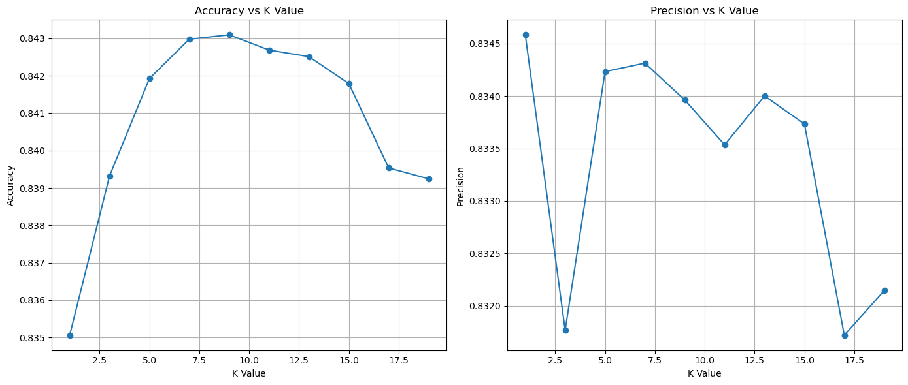
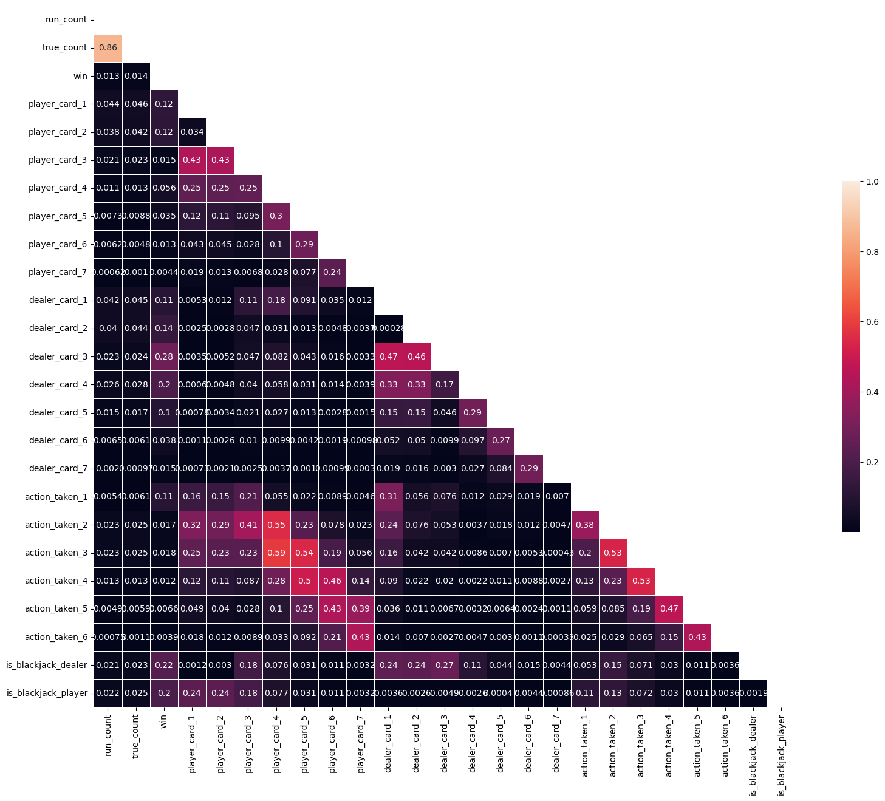
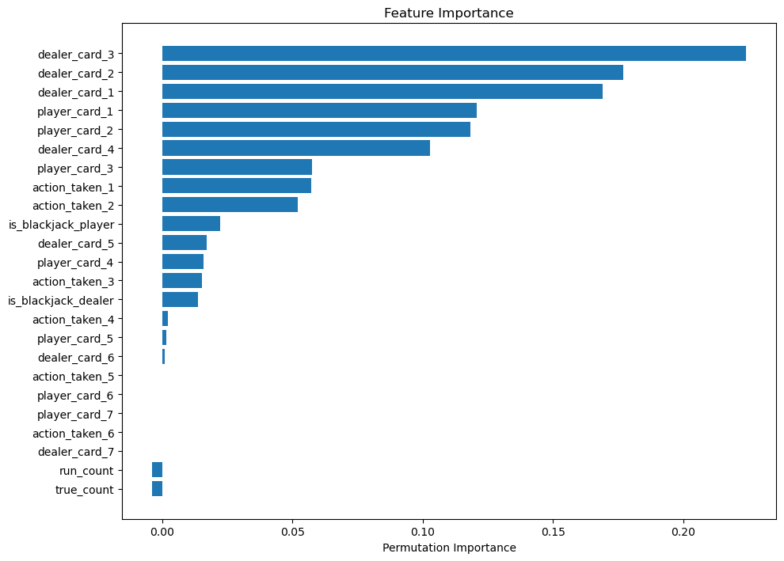

# Blackjack Win/Loss Prediction System

## Project Overview
This project aims to predict win/loss outcomes in Blackjack using machine learning. It incorporates various models and strategies to handle the inherent challenges of predictive modeling in card games.
- [Presentation]([#](https://www.canva.com/design/DAGJaU41uoo/4KqLcouORYkJmv49p9Xq0Q/edit?utm_content=DAGJaU41uoo&utm_campaign=designshare&utm_medium=link2&utm_source=sharebutton))
## Dataset
The Dataset is a collection of 50M Blackjack hand generated from Kaggle which can befound at this link [Kaggle]([#](https://www.kaggle.com/datasets/dennisho/blackjack-hands))
The dataset includes multiple fields from which fields focused on are such as:
- `shoe_id`: Shoe identifier
- `cards_remaining`: Cards remaining at the start of a round
- `dealer_up`: Visible card of the dealer
- `initial_hand`: Initial player cards
- `dealer_final_value`: Final value of dealer's hand
- `player_final_value`: Final value of player's hand
- `actions_taken`: Actions taken by the player
- `win`: Amount won/lost in the round

## Models Used
- **K-Nearest Neighbors (KNN)** running with k in range of (1,20)
 
- **Random Forest**
- **Gradient Boosting**
- **AdaBoost with RandomForest and DecisionTree (Voting Ensemble)**

## Performance Analysis
The models' performances were evaluated based on precision, recall, and F1-scores. Adjustments were made using SMOTE to address class imbalance, particularly improving the recall for minority classes.
The best result was result from **AdaBoost and DecisionTree** which has a weighted F1-Scores of **0.919** and a precision score of **0.922** and with features importance mapped out as 

## Requirements
- Python 3.8+
- Libraries: scikit-learn, pandas, numpy

## Setup and Execution
1. Install the required Python libraries.
2. Run the Jupyter Notebook to train models and evaluate performance.

## Contributing
Contributions to this project are welcome. Please fork the repository and submit a pull request.
